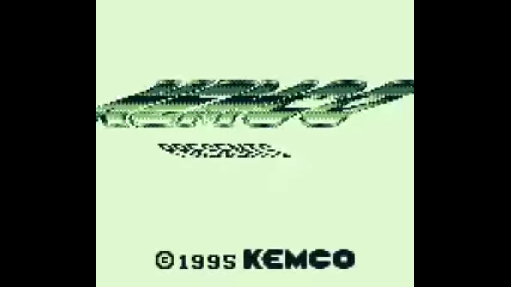

# EMU Ladies: A Gameboy Emulator 

by Annabelle Platt and Emma Mack

## Goals For This Project
Our main goal was to make a Game Boy emulator that can run the Tetris home screen. Our lower bound was to emulate the CPU and the graphics system, integrated in a main loop with basic timings. We went slightly beyond this and set up a structure to carry out opcodes (the low-level instructions that sequentially run the game, like instructions in assembly). 

Our stretch goal, which we did not reach, is to implement simple ROM banking, which swaps out ROMS, allowing games to be larger than can be stored in the physical memory at any given time. This is not necessary for Tetris, but is necessary for most Gameboy games.


## Learning Goals
Annabelle: I had such a fun time with my first emulator, and I wanted to further my knowledge by learning about a more advanced system. In particular I wanted to learn more about techniques for rendering graphics. The CHIP-8 has a very simple, black and white graphics system, but Game Boys have so much more going on, and I wanted to learn more about graphics on a processing level.

Emma: I was excited to understand more concretely how a simple(ish) program runs on a base level - work more directly with registers, program counters, decoding instructions, etc.


## What We Achieved

As a disclaimer, our code does not run a game. The GameBoy subsystems are extremely inter-dependent in a way that makes them difficult to implement and debug independently. We will be pointing out places where we suspect bugs might lie.

### CPU structure

The “CPU” in a GameBoy handles all central processing. For our emulator, we created a Cpu class and included everything having to do with main memory, the stack pointer, the program counter, and opcode methods.

Memory is a simple array, private to the Cpu class, and accessed via methods. An example is the write_memory() function, which needs to deal with the fact that different sections of memory have different access levels.

```
int Cpu::write_memory(uint16_t address, uint8_t data) {
    if (address < 0x8000) {
        fprintf(stderr, "Tried to write to read-only memory");
        return 0;

    } else if ((address >= 0xE000) && (address < 0xFE00)) {
        memory[address] = data;
        write_memory(address-0x2000, data);
        return 1;

    } else if ((address >= 0xFEA0) && (address < 0xFEFF)) {
        fprintf(stderr, "Tried to write to restricted memory");
        return 0;

    } else {
        memory[address] = data;
        return 1;
    }
}
```

The Program Counter is a uint16_t which points in memory to the current instruction being executed, and the Stack Pointer is a uint16_t which keeps track of where the program is on the stack, much like in C. The Stack Pointer is incremented when a new subroutine is called and decremented when a subroutine returns. 

### Registers

In the GameBoy, there are eight 8-bit registers, which are shorter-term memory that store high/low values often referenced by the game, such as what mode the graphics system is currently operating in. The registers are sometimes read together (as a 16-bit int), so we made a register class of 16-bit registers which is instantiated four times. Each have a “high” and a “low” section, high being the first byte and low being the second byte. We wrote functions that, using bit operations, read and wrote to the high and low sections. 

```
void Register::set_lo(uint8_t val) {
    reg = (reg & 0xFF00) | val;
}

void Register::set_hi(uint8_t val) {
    reg = (reg & 0x00FF) | (val << 8);
}

void Register::set_all(uint16_t val) {
    reg = val;
}
```
The registers are then initialized to certain values by the CPU when it is instantiated. This is so that all structures are where a game ROM would expect them to be when loaded in, and the game can start running and modifying structures knowing they pointing to the correct places or contain the correct values

```
Cpu::Cpu() {
    AF.set_all(0x01B0);
    BC.set_all(0x0013);
    DE.set_all(0x00D8);
    HL.set_all(0x014D);
…
```

### Graphics

The graphics in an emulator can be broken into two parts: the side that interacts with the game, and the side that interacts with the laptop running the emulator. For the laptop side, we used the SDL library, which takes a data structure containing pixel color values and can display it on a screen. For the side that interacts with the emulator, we created a Screen class, which contains the data structure to be passed to SDL for rendering. Below is a demonstration in which we initialize all the screen pixels to black, then set the top half to light grey. The screen data structure is then passed to SDL, along with a scaling factor. SDL take in the pixels, scales appropriately, and renders the data onscreen. 


While this is a simple demonstration, we can put anything we want into the SDL display (provided it’s encoded correctly), and it will render it for us. SDL is not a true part of the Gameboy, but a medium that allows us to display the Gameboy data. 

Understanding how the GameBoy displays graphics, and translating that to methods of the Screen class, was where the most amount of our time, and learning, lay for this project. We did not fully successfully implement all of it, but we will go into extreme detail in the conceptual inner workings of it.

#### **Graphics Structure:**

The Gameboy uses three different layers to create its graphics. At the very bottom is the background map, which comprises the environment of a game. This is 256x256 pixels, broken down into 32x32 tiles, which we will discuss momentarily. Next is the window, which to the player appears not to move. This might be used for displaying a score which is always at the bottom of the screen. On top of that is where sprites go. This would be the character a player is controlling, but could also be anything that needs to interact with the background. (A super interesting fact we discovered is that in Tetris, pieces are sprites while falling but become background tiles once they land). We did not implement the window or sprites so we will not talk much about them. 

On top of all this, only a portion of the screen (160x144 pixels) is displayed at a time. The game pans across the background to display different parts of it as the player moves. 

#### **Pixel representations**
Each pixel is represented by two bits. The two bits represent the color of the tile, either 00 for white, 01 for light grey, 10 for dark grey, or 11 for black. These are the only four colors supported by the original Gameboy, though future versions would go on to add color. This is an oversimplification, as each pixel is then put through a transform to determine the actual color, but we  did not get to implement this feature. The important thing to note is that this transform, like so many other design decisions in the Gameboy, allowed game developers to show differently colored versions of pixels/sprites/tiles without having to store a whole new version in memory. (For example, instead of having to store a regular Mario sprite and an inverted Mario sprite in memory, developers could just invert the color mapping.)

Below is part of a function that maps GameBoy pixel color to SDL color:

```
uint32_t Screen::bit_color_to_SDL_color(uint8_t color_bits) {
    switch (color_bits) {
    case 0:
        return 0xFFFFFFFF;
        break;
    case 1:
        return 0xC0C0C0FF;
        break;
…
```
 
#### **Tiles and Background Maps**
As mentioned before, the background layer of tiles is comprised of tiles. Each tile is 8x8 pixels. Here we encounter another genius optimization of the Gameboy. There are two separate locations in memory, one that stores tiles and one that store background maps. The location that stores tiles will contain the data for all the tiles (essentially the pixels and their colors), but importantly each tile must only be stored once. The location in memory that stores background maps stores which tiles go in which order. This means that instead of storing multiple of the same tile, the background map can just specify that the system needs to get the data for the same tile multiple times. 


#### **Scanlines**
The Gameboy draws its display area (note this is the smaller display area, not the larger background), one pixel at a time, top to bottom and left to right. Each line is known as a scanline. At the end of each scanline there is a short amount of time while the system moves across to start the next line. This period is known as horizontal blank, or H-blank. At the end of the last scanline there is a similar but longer period while the system moves from the bottom right end of the scanline to the top left to start drawing the screen again. This is known as vertical blank, or V-blank. During this time the PPU is idle, so more data can be fetched and added in. 


One of the most interesting optimizations of the Gameboy occurs during scanline drawing. There are two registers holding x and y offsets, which tell the PPU how far in and how far down to start drawing the scanline (anything that gets pushed off the screen will wrap to the other side). Game developers can adjust these offsets to create incredible effects without having to store more tile data. 


For example, the logo shown below distorts and waves back and forth before settling into its final form:




This is done purely using scanlines and offsets. There is a register that holds the current scanline and a register holding the desired scanline. If these two are equal, an interrupt fires, and the offsets can now be adjusted even though not all the scanlines have been drawn yet. So, a developer could have an initial offset of 0, but only up to line 3. At the end of the third scanline the registers will compare, the interrupt will fire, and the developer can set the offset to something else, say 5. This means that the first three scanlines will be drawn with an offset of 0, but the next will be drawn with an offset of 5. The developer can do this as many times as they want. In the case of the Kemco logo, we can see that every line with the logo has a different offset. This is the technique used to make the logo distort, but it can also be used to make a skyline shift or a road curve, all without storing any extra tile or sprite data. In addition, this logo uses only an x offset, meaning a side-to-side offset, but y offsets are also possible, allowing for rolling hills or waves. 

We think our draw_scanline() function is a good example of working in code with tiles and scanlines. First the function grabs some data from the LCD register…

```
void Screen::draw_scanline() {
    uint8_t tile_size_in_memory = 16;

    uint8_t LCD_control = cpu->read_memory(LCDC); // store the LCD control register
    uint8_t scroll_x = cpu->read_memory(SCX);
    uint8_t scroll_y = cpu->read_memory(SCY);
    uint8_t window_y = cpu->read_memory(WY);
…
```

Then it processes which tile map to search, then looks up tile addresses in the tile map, unpacks the tile data, and sets the corresponding SDL data structure pixels to the correct color. (The middle of the function is not shown.)

```
if ((LCD_control & 0x8) >> 3) {
            tile_data_address = 0x8000 + (tile_id)*tile_size_in_memory;
        } else {
            tile_data_address = 0x9000 + ((int8_t)tile_id + 128) * tile_size_in_memory;
        }

        // get the bytes that contain the row's color data
        uint8_t row_within_tile = abs_y % 8;
        uint16_t curr_row_address = tile_data_address + 2*row_within_tile;
        uint8_t row_byte1 = cpu->read_memory(curr_row_address);
        uint8_t row_byte2 = cpu->read_memory(curr_row_address + 1);

        uint8_t pixel_within_row = abs_x % 8;

        //bitshifting to grab actual pixel data
        uint8_t color = (row_byte1 & 1<<(8-pixel_within_row)) + ((row_byte2 & (8-pixel_within_row)) << 1);
        set_pixel(color, abs_x, abs_y);
 }
```

### Opcodes

Opcodes are like instructions in assembly - a game file (and thus main memory in the GameBoy while it is running) is mostly made up of them, and they are bytes that encode small instructions like writing to a register, jumping to a different piece of memory, or doing a logic operation. The program runs by running though opcodes sequentially, until it hits an opcode that tells it to jump to another opcode. As mentioned before, the Program Counter points to which opcode the program is currently executing. 

A GameBoy emulator needs to decode each opcode into the instruction that it represents, and execute it, all while ensuring that the Program Counter stays in the right place. We did the decoding with a switch statement (which only decodes one opcode due to time constraints): 

```
int Cpu::execute_next_opcode() {
uint8_t opcode = read_memory(PC);
    int cycles = 0;
    printf("Opcode = 0x%x\n", opcode);
    inc_PC();
    switch (opcode) {
            case 0xC3:
            cycles = op_jpnn();
            break;
            default:
                    printf("Unknown opcode: %x\n", opcode);
    }
    return cycles;
}
```

Below is a printout of the first five opcodes found by the program. All except 0xC3 are unknown because we only implemented 0xC3 (otherwise known as JPNN, which is short for “jump to location nn”). This shows that we have likely loaded the ROM correctly, since it makes sense that the first instruction is to jump to a new instruction. (0x00 does not really count, as it essentially means “do nothing until you’re told to do something”). When we jump to that location we get opcode 0x2C, which tells us to increment a register. This also makes sense, so it seems we have implemented our ROM loading and opcode processing structure correctly. 


The execution of an opcode looks like this:

```
int Cpu::op_jpnn() {
    uint16_t address = (read_memory(PC) << 8) | read_memory(PC+1);
    set_PC(address);
    return 12;
}
```

Opcodes are short, self-contained operations that do a few small tasks. For this particular one, we read the two bytes next to the opcode and put them together. This gives us the location to jump to in memory. Setting the program counter to that location is how we perform that jump. The next opcode will be read from that location. The function returns 12 because that is how many cycles the opcode takes to execute. Keeping track of cycles is critical to ensuring that the emulator is running at the correct speed. 

### Loading ROM

At boot-up, a GameBoy emulator needs to load a game file into memory. A game file, and the memory of a GameBoy, is simply a string of bytes. We loaded memory simply by using fopen() to open the game file, and inserting the bytes into memory starting at 0. 

Most games are too large to fully fit in ROM, so the Gameboy uses a technique called memory banking to swap ROMs in and out. Tetris does not, so we did not even attempt to implement memory banking. If we had, we would have likely needed another function that would clear the memory in some locations and read a new ROM in. 

### Main loop

The main loop is where all the pieces come together. We wanted the main loop to be clean and high level, so we abstracted operations out into functions wherever we could. 

```
    int quit = 0;
    while (!quit) {
        quit = process_input();
        int cycles_this_update = 0;
        
        while (cycles_this_update < MAX_CYCLES) {
            cycles_this_update += cpu.execute_next_opcode();
            screen.draw_all_scanlines(cycles_this_update);
        }

        update_graphics(&renderer, &texture, &screen_loc, ROW_SIZE);
    }
```

The secondary while loop executes opcodes and updates the graphics on the game side until the Cpu hits the maximum number of cycles that can be executed between screen updates (equal to 1/60th of a second). Then, the laptop-side graphics update, and this continues.

The main loop also handles the exit [action] of the program, which is the user pressing ESC. 

### Unit testing structure

Finally, we set up a unit testing structure using MinUnit, which we used to test graphics and registers. A register method test for example:

```
static char* test_set_hi() {
    register1.set_hi(0x49);
    char* message = "Hi bit set to wrong value\n"   ;
    mu_assert(message, register1.get_all() == 0x4900);
    return NULL;
}
```

## Design Decisions

### C++  
Right from the start, a major design decision that we made was to use C++ instead of pure C. This was because in Annabelle’s first project, the biggest problem she encountered was code sharing between files. She managed to get away with it due to the small size of the CHIP-8, but it was clear with the much more complex system of the Gameboy that more codesharing flexibility would be needed. This turned out to be a very good decision, as a huge part of writing an emulator is performing operations on the CPU or Pixel Processing Unit (PPU) structures, and being able to write methods specific to each class which then allowed the classes to interact proved invaluable. 

In addition to codesharing, using classes allowed us to better enforce the physical constraints of the system. One example of this is the Gameboy’s memory, which is divided into multiple different sections. These sections can be accessed in different ways under different conditions. In the physical system, these are physically in different locations, but in our emulator all of memory is represented as one large array. Using classes allowed us to easily write get and set methods that allowed us to easily regulate memory access instead of needing to keep the rules in our heads or passing pointers to pointers around, thereby making our code safer and cleaner. 

### Registers 
The Gameboy has eight 8-bit registers. However, these registers can also be stuck together and read as a single 16-bit register. Many implementations we saw chose to implement these as unions, where the register would be either 8-bit or 16-bit. We chose instead to store four 16-bit registers. We could then access an 8-bit register by reading the high or low byte of the appropriate register, as shown in the previous section.

This was a simple solution that eliminated the need for dealing with unions, simplified our code, and gave us a chance to practice working with bitwise operations. 

### Display data type

One of the places we had the most architecture flexibility was with the laptop side of the display, since that was the least dictated by the specifics of GameBoy operation.  So, we got to design the interaction between how the GameBoy stores graphics and SDL. We chose to store the screen data as a 1D array that contained 32 bit integers, since that would be the easiest to pass to SDL. We nixed the idea of updating SDL pixel by pixel, since that would have been inefficient. 

Here is the function that takes an x and a y value, plus a color the way that the GameBoy stores it, and sets the correct pixel in the array of uint32s  that is passed to SDL.

```
void Screen::set_pixel(uint8_t color, int x, int y) {
    uint32_t pixel = bit_color_to_SDL_color(color);
    window[x + width * y] = pixel;
}
```

## Outcomes 

We did not successfully run the Tetris homescreen, but we did meet our lower bounds of emulating a CPU and graphics system, integrated in a main loop with basic timings. Additionally, we added a structure for running opcodes, which was slightly beyond our lower bound.

Emma: I certainly achieved my learning goals! I learned a ton about how memory can be segmented and accessed, including how and why registers exist and how to use bitwise operations to access them. I also learned about how a program sequentially runs -- using a program counter and the types of instructions you’ll find in assembly. 

Annabelle: Although this emulator is technically not as functional as my previous emulator, I learned so much more in the process of making this one. While the CHIP-8 is essentially just one small CPU doing everything, the Gameboy is a much more complex physical system, with lots of different parts interacting in ways that I didn’t get to explore at all in the CHIP-8. The CHIP-8 was a fantastic starter system and absolutely necessary to take on the Gameboy to the extent that we did, but I’ve learned so much more about how a real, advanced system works on this project, which was one of my learning goals. My other learning goal was to learn more about graphics rendering and I cannot stress enough how on the nose this was. The bulk of our work on this project was figuring out how the graphics system on the Gameboy works, and to me this was what really cracked open the genius optimization of the system and brought together what had seemed to be arbitrary statistics about Gameboy graphics and memory usage. I feel absolutely satisfied in achieving my learning goals. 

Overall, both of us got a lot out of learning about the types of tricks programmers would use to design software systems around the limitations of hardware, such as using tiles and scanline offsets to not store repetitive screen data, and packing together eight two-bit numbers into two bytes by matching together bits between bytes.

We also (as we’ve talked about) learned a whole bunch about the internals of the GameBoy and how different units of a game system -- CPU, PPU, inputs -- interact. We had a lot of fun researching and learning about it, and implementing what we could. The implementation forced us to understand the system at a deep level, and although our code is far from finished, it certainly served its purpose in teaching us how to represent a physical console as software. 

## Resources

* [The official GameBoy CPU manual](http://www.codeslinger.co.uk/pages/projects/gameboy/files/GB.pdf)
* [Codeslinger tutorial](http://www.codeslinger.co.uk/pages/projects/gameboy.html) on writing a Game Boy emulator
* [Imran Nazar tutorial](http://imrannazar.com/GameBoy-Emulation-in-JavaScript:-The-CPU) on writing a Game Boy emulator in Javascript
* [Cinoop tutorial](https://cturt.github.io/cinoop.html) in C, this one more high level conceptual and less in depth
* [A reference table](https://meganesulli.com/generate-gb-opcodes/) of opcodes
* [An emulator we found on GitHub](https://github.com/jgilchrist/gbemu), which strongly utilizes classes in C++
* [The Ultimate Gameboy Talk](https://www.youtube.com/watch?v=HyzD8pNlpwI&t=3218s), a video that goes into extreme depth on everything about the Gameboy that helped us crack open the graphcis
* [A video about GameBoy color graphics](https://www.youtube.com/watch?v=ZEJVOH6Pxkg&t=446s) that was also very helpful in figuring out graphics


